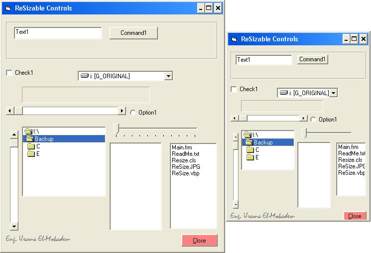



## Form controls automatic resize

### Description

Resize all form controls automaically, when resize the form
 
### More Info
 

             |
---                |---
**Submitted On**   |2007-05-02 08:57:30
**By**             |[Eng\. Usama El\-Mokadem](https://github.com/Planet-Source-Code/PSCIndex/blob/master/ByAuthor/eng-usama-el-mokadem.md)
**Level**          |Intermediate
**User Rating**    |5.0 (10 globes from 2 users)
**Compatibility**  |VB 5\.0, VB 6\.0
**Category**       |[Miscellaneous](https://github.com/Planet-Source-Code/PSCIndex/blob/master/ByCategory/miscellaneous__1-1.md)
**World**          |[Visual Basic](https://github.com/Planet-Source-Code/PSCIndex/blob/master/ByWorld/visual-basic.md)
**Archive File**   |[Form\_contr2065695142007\.zip](https://github.com/Planet-Source-Code/eng-usama-el-mokadem-form-controls-automatic-resize__1-68595/archive/master.zip)

